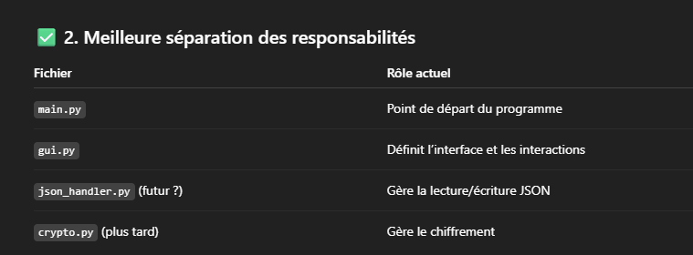

* Faire en sorte qu'on puisse afficher et masquer les mdp sur l'interface graphique > KeyPass\
* Deux langues à coder, anglais et français\
* Appli à coder pour pc et smartphone, synchro à faire\
* Bouton copier coller sur username et mdp\
* Bouton pour afficher/masquer le mot de passe\
* Faire en sorte que le mot de passe passe de crypté à non crypté en graphique comme en console
* Faire un all in one pour utilisateur (.exe)
* Faire une interface web (hmtl, css, js, sql)

