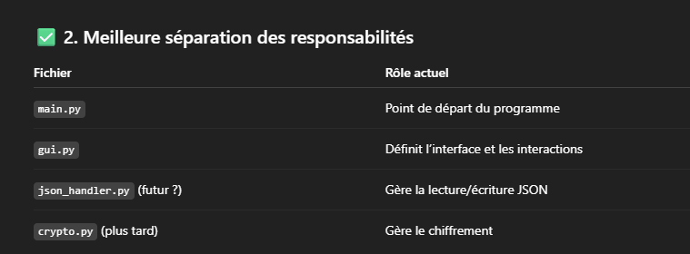

Faire en sorte qu'on puisse afficher et masquer les mdp sur l'interface graphique > KeyPass\
Deux langues à coder, anglais et français\
Appli à coder pour pc et smartphone, synchro à faire\
Bouton copier coller sur username et mdp\
Bouton pour afficher/masquer le mot de passe\
Faire en sorte que le mot de passe passe de crypté à non crypté en graphique comme en console\

Continuer en modifiant add_entry, edit_entry et delete_entry pour que ça modifie directement le .json\
main.py en tronc d'arbre et le reste en branche

