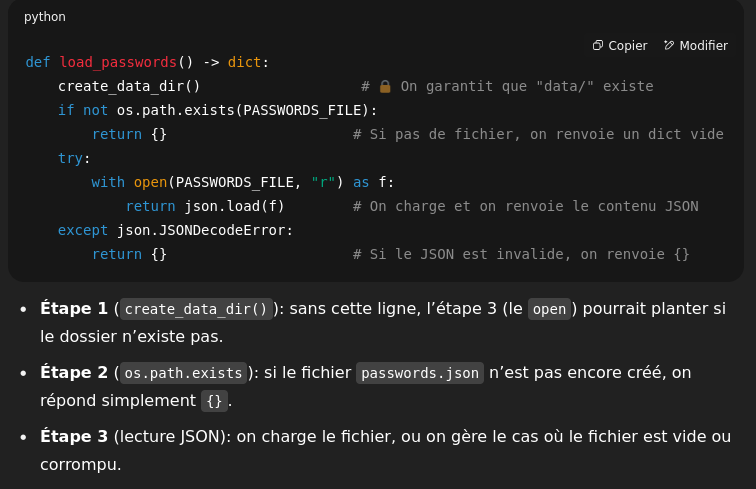

Un peu de jargon :

* Static analyzer (analyseur statique) :
Un outil (comme pylint, mypy, flake8…) qui lit ton code sans l’exécuter, cherche des erreurs potentielles (typos, variables non définies, incohérences de types). Il t’alerte tôt, avant même que tu lances ton programme.

* Branche (if / else) :
Imagine un embranchement sur la route : le code suit soit le chemin “if” (si la condition est vraie), soit le “else” (sinon). Chaque branche peut avoir son propre return ou ses propres actions.

* return :
Mot-clé qui sort de la fonction et renvoie une valeur. Tout ce qui suit dans la fonction n’est pas exécuté.

* Exception (raise) :
Procédé pour signaler une erreur. Quand on lève (raise) une exception non attrapée, le programme s’arrête (à moins que tu gères l’exception ailleurs). C’est plus propre que de faire un exit(), car l’analyseur comprend qu’après un raise on ne continue pas.

* os.makedirs(..., exist_ok=True) :
Crée un dossier (et ses dossiers parents) si besoin sans crasher si le dossier existe déjà.

* json.dump / json.load :
Pour écrire/charger des données structurées (dictionnaires, listes) dans un fichier texte au format JSON.

Imports :

* os/json/base64 sont des bibliothèques intégrées à Python.
* cryptography est une lib tierce (installée avec pip install cryptography).

Constants :

* DATA_DIR est une chaîne indiquant le dossier
* Les deux os.path.join assemblent un chemin valide (Windows/Linux).

ensure_data_dir() :

* os.makedirs(..., exist_ok=True) crée le dossier récursivement (tous les dossiers parents nécessaires) et n’erreur pas si déjà créé.

Dérivation de clé :

* On utilise PBKDF2HMAC (KDF) pour transformer le mot de passe en une clé binaire fiable.
* Puis on encode cette clé en Base64 pour qu’elle soit compatible avec l’API Fernet.

